# Frontend Toolkit / 前端工具包

A comprehensive collection of professional frontend utilities for modern JavaScript/TypeScript applications.

一套全面的现代 JavaScript/TypeScript 应用程序专业前端工具集合。

[](https://opensource.org/licenses/MIT)
[](https://www.typescriptlang.org/)
[](https://webpack.js.org/guides/tree-shaking/)

## 📦 Packages / 包

| Package                                          | Description                                                                                                                                      | Version                                                   |
| ------------------------------------------------ | ------------------------------------------------------------------------------------------------------------------------------------------------ | --------------------------------------------------------- |
| [@gvray/eskit](./packages/eskit)                 | Pure JavaScript/TypeScript language enhancements<br/>纯 JavaScript/TypeScript 语言增强                                                           |          |
| [@gvray/domkit](./packages/domkit)               | Browser and DOM manipulation utilities<br/>浏览器和 DOM 操作工具                                                                                 |         |
| [@gvray/adminkit](./packages/adminkit)           | Business logic and admin development utilities<br/>业务逻辑和管理开发工具<br/>📋 Clipboard • 💾 Storage • 🎭 Events • ⏳ Loading • 📊 Formatting |       |
| [@gvray/pathkit](./packages/pathkit)             | Path manipulation and URL utilities<br/>路径操作和 URL 工具                                                                                      |        |
| [@gvray/datekit](./packages/datekit)             | Professional date and time manipulation<br/>专业的日期时间操作                                                                                   |        |
| [@gvray/validationkit](./packages/validationkit) | Comprehensive data validation and forms<br/>全面的数据验证和表单                                                                                 |  |
| [@gvray/mathkit](./packages/mathkit)             | Mathematical utilities and calculations<br/>数学工具和计算                                                                                       |        |

## 🏗️ Architecture / 架构

```mermaid
graph TB
    subgraph "Frontend Toolkit"
        A[eskit<br/>Language Enhancements<br/>语言增强]
        B[domkit<br/>DOM Utilities<br/>DOM工具]
        C[adminkit<br/>Business Logic<br/>业务逻辑]
        D[pathkit<br/>Path Utilities<br/>路径工具]
        E[datekit<br/>Date/Time<br/>日期时间]
        F[validationkit<br/>Validation<br/>验证]
        G[mathkit<br/>Mathematics<br/>数学计算]
    end

    subgraph "Core Responsibilities / 核心职责"
        A --> A1[Type checking<br/>类型检查]
        A --> A2[Object utilities<br/>对象工具]
        A --> A3[Function utilities<br/>函数工具]

        B --> B1[DOM manipulation<br/>DOM操作]
        B --> B2[Event handling<br/>事件处理]
        B --> B3[Browser APIs<br/>浏览器API]

        C --> C1[Clipboard operations<br/>剪贴板操作]
        C --> C2[Storage management<br/>存储管理]
        C --> C3[Event system<br/>事件系统]
        C --> C4[Loading management<br/>加载管理]
        C --> C5[Business formatting<br/>业务格式化]

        D --> D1[URL parsing<br/>URL解析]
        D --> D2[Path manipulation<br/>路径操作]

        E --> E1[Date formatting<br/>日期格式化]
        E --> E2[Time calculations<br/>时间计算]
        E --> E3[Timezone handling<br/>时区处理]

        F --> F1[Data validation<br/>数据验证]
        F --> F2[Form validation<br/>表单验证]
        F --> F3[Schema validation<br/>模式验证]

        G --> G1[Arithmetic operations<br/>算术运算]
        G --> G2[Random generation<br/>随机生成]
        G --> G3[Sequences<br/>序列]
    end
```



## ✨ Features / 特性

- 🎯 **Focused packages** - Each package has a clear, single responsibility / 专注的包 - 每个包都有明确的单一职责
- 🔧 **TypeScript first** - Built with TypeScript, full type definitions / TypeScript 优先 - 使用 TypeScript 构建，完整类型定义
- 📦 **Tree-shakable** - Import only what you need / 支持摇树优化 - 只导入需要的功能
- 🌐 **Bilingual docs** - English and Chinese documentation / 双语文档 - 英文和中文文档
- ✅ **Well tested** - Comprehensive test coverage / 充分测试 - 全面的测试覆盖
- 🚀 **Production ready** - Battle-tested in real applications / 生产就绪 - 在实际应用中经过实战测试

## 🚀 Quick Start / 快速开始

### Install individual packages / 安装单个包

```bash
# Language enhancements / 语言增强
npm install @gvray/eskit

# DOM utilities / DOM工具
npm install @gvray/domkit

# Business utilities / 业务工具
npm install @gvray/adminkit

# Path utilities / 路径工具
npm install @gvray/pathkit

# Date/time utilities / 日期时间工具
npm install @gvray/datekit

# Validation utilities / 验证工具
npm install @gvray/validationkit

# Mathematical utilities / 数学工具
npm install @gvray/mathkit
```

### Usage examples / 使用示例

```typescript
// Language enhancements / 语言增强
import { isObject, deepClone, memoize } from '@gvray/eskit'

// DOM utilities / DOM工具
import { addClass, removeClass, on, off } from '@gvray/domkit'

// Business utilities / 业务工具
import { throttle, debounce, formatMoney } from '@gvray/adminkit'

// Path utilities / 路径工具
import { joinPath, parsePath, isAbsolute } from '@gvray/pathkit'

// Date utilities / 日期工具
import { formatDate, addDays, isWeekend } from '@gvray/datekit'

// Validation utilities / 验证工具
import { email, required, minLength } from '@gvray/validationkit'

// Mathematical utilities / 数学工具
import { add, randomInt, fibonacci } from '@gvray/mathkit'
```

## 📚 Documentation / 文档

Each package has its own detailed documentation:

每个包都有自己的详细文档：

- [ESKit Documentation](./packages/eskit/README.md) - Language enhancements / 语言增强
- [DOMKit Documentation](./packages/domkit/README.md) - DOM utilities / DOM 工具
- [AdminKit Documentation](./packages/adminkit/README.md) - Business utilities / 业务工具
- [PathKit Documentation](./packages/pathkit/README.md) - Path utilities / 路径工具
- [DateKit Documentation](./packages/datekit/README.md) - Date/time utilities / 日期时间工具
- [ValidationKit Documentation](./packages/validationkit/README.md) - Validation utilities / 验证工具
- [MathKit Documentation](./packages/mathkit/README.md) - Mathematical utilities / 数学工具

## 🔄 Migration Guide / 迁移指南

### Breaking Changes in v2.0 / v2.0 中的破坏性变更

1. **Moved functions / 移动的函数**:

   - `throttle` and `debounce` moved from `eskit` to `adminkit` / `throttle`和`debounce`从`eskit`移动到`adminkit`
   - Mathematical functions (`add`, `subtract`, etc.) moved from `eskit` to `mathkit` / 数学函数（`add`、`subtract`等）从`eskit`移动到`mathkit`
   - `formatMoney` moved from `eskit` to `adminkit` / `formatMoney`从`eskit`移动到`adminkit`

2. **New packages / 新包**:
   - `@gvray/datekit` - Professional date/time utilities / 专业日期时间工具
   - `@gvray/validationkit` - Comprehensive validation / 全面验证
   - `@gvray/mathkit` - Mathematical utilities / 数学工具

### Migration steps / 迁移步骤

```typescript
// Before v2.0 / v2.0之前
import { throttle, add, formatMoney } from '@gvray/eskit'

// After v2.0 / v2.0之后
import { throttle, formatMoney } from '@gvray/adminkit'
import { add } from '@gvray/mathkit'
```

## 🤝 Contributing / 贡献

We welcome contributions! Please see our [Contributing Guide](./CONTRIBUTING.md) for details.

我们欢迎贡献！请查看我们的[贡献指南](./CONTRIBUTING.md)了解详情。

## 📄 License / 许可证

MIT License - see the [LICENSE](./LICENSE) file for details.

MIT 许可证 - 查看[LICENSE](./LICENSE)文件了解详情。

## 🙏 Acknowledgments / 致谢

Thanks to all contributors who have helped make this toolkit better.

感谢所有帮助改进此工具包的贡献者。

# Toolkit

一个实用的工具包集合，提供各种常用功能的封装。

## 工具包列表

### adminkit

一个用于快速构建后台管理系统的工具包，提供常用的管理功能组件。

主要功能：

- 用户管理（创建、编辑、删除、查询）
- 角色管理（创建、编辑、删除、查询）
- 权限管理（创建、编辑、删除、查询）
- 用户-角色关联管理
- 角色-权限关联管理
- 用户认证和授权
- 数据验证和错误处理

### arraykit

一个用于处理数组的工具包，提供常用的数组操作函数。

主要功能：

- 数组分组
- 数组排序
- 数组过滤
- 数组映射
- 数组去重
- 数组扁平化
- 数组分块
- 数组随机打乱
- 数组交集/并集/差集
- 数组统计

### async

一个用于处理异步操作的工具包，提供常用的异步操作函数。

主要功能：

- 异步函数执行
- 异步函数重试
- 异步函数超时控制
- 异步函数并发控制
- 异步函数错误处理
- 异步函数结果缓存
- 异步函数队列
- 异步函数优先级
- 异步函数取消
- 异步函数进度跟踪

### auth

一个用于处理认证和授权的工具包，提供常用的认证和授权功能。

主要功能：

- 用户认证
- 用户授权
- 角色管理
- 权限管理
- 用户-角色关联
- 角色-权限关联
- 认证中间件
- 授权中间件
- 认证错误处理
- 授权错误处理

### cache

一个用于处理缓存的工具包，提供常用的缓存操作函数。

主要功能：

- 内存缓存
- 文件缓存
- Redis 缓存
- 缓存过期
- 缓存更新
- 缓存删除
- 缓存统计
- 缓存预热
- 缓存清理
- 缓存监控

### config

一个用于处理配置的工具包，提供常用的配置操作函数。

主要功能：

- 配置文件加载
- 配置项获取
- 配置项设置
- 配置项删除
- 配置项验证
- 配置项默认值
- 配置项类型转换
- 配置项环境变量
- 配置项加密
- 配置项热更新

### crypto

一个用于处理加密和解密的工具包，提供常用的加密和解密功能。

主要功能：

- 哈希计算
- 对称加密
- 非对称加密
- 数字签名
- 密码哈希
- 随机数生成
- 密钥生成
- 证书处理
- 加密流
- 解密流

### date

一个用于处理日期和时间的工具包，提供常用的日期和时间操作函数。

主要功能：

- 日期格式化
- 日期解析
- 日期计算
- 日期比较
- 日期验证
- 时区转换
- 相对时间
- 日期范围
- 工作日计算
- 节假日判断

### db

一个用于处理数据库操作的工具包，提供常用的数据库操作函数。

主要功能：

- 数据库连接
- 数据库查询
- 数据库事务
- 数据库迁移
- 数据库备份
- 数据库恢复
- 数据库监控
- 数据库优化
- 数据库安全
- 数据库日志

### debug

一个用于处理调试的工具包，提供常用的调试功能。

主要功能：

- 日志记录
- 错误跟踪
- 性能分析
- 内存分析
- CPU 分析
- 堆栈跟踪
- 断点设置
- 变量查看
- 条件断点
- 远程调试

### error

一个用于处理错误的工具包，提供常用的错误处理功能。

主要功能：

- 错误创建
- 错误分类
- 错误处理
- 错误日志
- 错误追踪
- 错误恢复
- 错误通知
- 错误统计
- 错误分析
- 错误报告

### event

一个用于处理事件的工具包，提供常用的事件处理功能。

主要功能：

- 事件发布
- 事件订阅
- 事件取消
- 事件过滤
- 事件转换
- 事件重试
- 事件持久化
- 事件监控
- 事件统计
- 事件分析

### file

一个用于处理文件的工具包，提供常用的文件操作函数。

主要功能：

- 文件读取
- 文件写入
- 文件删除
- 文件复制
- 文件移动
- 文件重命名
- 文件压缩
- 文件解压
- 文件加密
- 文件解密

### http

一个用于处理 HTTP 请求和响应的工具包，提供常用的 HTTP 操作函数。

主要功能：

- HTTP 请求
- HTTP 响应
- HTTP 中间件
- HTTP 路由
- HTTP 认证
- HTTP 缓存
- HTTP 压缩
- HTTP 重定向
- HTTP 代理
- HTTP 监控

### json

一个用于处理 JSON 的工具包，提供常用的 JSON 操作函数。

主要功能：

- JSON 解析
- JSON 序列化
- JSON 验证
- JSON 转换
- JSON 合并
- JSON 比较
- JSON 查询
- JSON 补丁
- JSON 模式
- JSON 统计

### log

一个用于处理日志的工具包，提供常用的日志操作函数。

主要功能：

- 日志记录
- 日志级别
- 日志格式
- 日志输出
- 日志过滤
- 日志轮转
- 日志压缩
- 日志分析
- 日志监控
- 日志告警

### math

一个用于处理数学运算的工具包，提供常用的数学运算函数。

主要功能：

- 基本运算
- 三角函数
- 指数对数
- 随机数
- 统计函数
- 矩阵运算
- 向量运算
- 几何运算
- 数值分析
- 优化算法

### net

一个用于处理网络操作的工具包，提供常用的网络操作函数。

主要功能：

- TCP 连接
- UDP 连接
- WebSocket
- 网络诊断
- 网络监控
- 网络优化
- 网络安全
- 网络协议
- 网络工具
- 网络测试

### number

一个用于处理数字的工具包，提供常用的数字操作函数。

主要功能：

- 数字格式化
- 数字解析
- 数字验证
- 数字转换
- 数字比较
- 数字计算
- 数字统计
- 数字生成
- 数字分析
- 数字可视化

### object

一个用于处理对象的工具包，提供常用的对象操作函数。

主要功能：

- 对象合并
- 对象克隆
- 对象比较
- 对象转换
- 对象验证
- 对象遍历
- 对象过滤
- 对象映射
- 对象统计
- 对象分析

### path

一个用于处理路径的工具包，提供常用的路径操作函数。

主要功能：

- 路径解析
- 路径合并
- 路径规范化
- 路径验证
- 路径转换
- 路径比较
- 路径遍历
- 路径过滤
- 路径统计
- 路径分析

### process

一个用于处理进程的工具包，提供常用的进程操作函数。

主要功能：

- 进程创建
- 进程终止
- 进程通信
- 进程监控
- 进程管理
- 进程优化
- 进程安全
- 进程日志
- 进程统计
- 进程分析

### queue

一个用于处理队列的工具包，提供常用的队列操作函数。

主要功能：

- 队列创建
- 队列操作
- 队列监控
- 队列管理
- 队列优化
- 队列安全
- 队列日志
- 队列统计
- 队列分析
- 队列可视化

### random

一个用于处理随机数的工具包，提供常用的随机数操作函数。

主要功能：

- 随机数生成
- 随机数验证
- 随机数转换
- 随机数比较
- 随机数统计
- 随机数分析
- 随机数可视化
- 随机数测试
- 随机数优化
- 随机数安全

### regex

一个用于处理正则表达式的工具包，提供常用的正则表达式操作函数。

主要功能：

- 正则表达式创建
- 正则表达式匹配
- 正则表达式替换
- 正则表达式验证
- 正则表达式转换
- 正则表达式比较
- 正则表达式统计
- 正则表达式分析
- 正则表达式优化
- 正则表达式测试

### string

一个用于处理字符串的工具包，提供常用的字符串操作函数。

主要功能：

- 字符串格式化
- 字符串解析
- 字符串验证
- 字符串转换
- 字符串比较
- 字符串统计
- 字符串分析
- 字符串可视化
- 字符串测试
- 字符串优化

### test

一个用于处理测试的工具包，提供常用的测试操作函数。

主要功能：

- 单元测试
- 集成测试
- 性能测试
- 压力测试
- 安全测试
- 兼容性测试
- 自动化测试
- 测试报告
- 测试监控
- 测试分析

### time

一个用于处理时间的工具包，提供常用的时间操作函数。

主要功能：

- 时间格式化
- 时间解析
- 时间验证
- 时间转换
- 时间比较
- 时间统计
- 时间分析
- 时间可视化
- 时间测试
- 时间优化

### type

一个用于处理类型的工具包，提供常用的类型操作函数。

主要功能：

- 类型检查
- 类型转换
- 类型验证
- 类型比较
- 类型统计
- 类型分析
- 类型可视化
- 类型测试
- 类型优化
- 类型安全

### url

一个用于处理 URL 的工具包，提供常用的 URL 操作函数。

主要功能：

- URL 解析
- URL 构建
- URL 验证
- URL 转换
- URL 比较
- URL 统计
- URL 分析
- URL 可视化
- URL 测试
- URL 优化

### util

一个用于处理通用功能的工具包，提供常用的通用操作函数。

主要功能：

- 工具函数
- 辅助函数
- 通用函数
- 扩展函数
- 兼容函数
- 性能函数
- 安全函数
- 调试函数
- 测试函数
- 文档函数

### validate

一个用于处理验证的工具包，提供常用的验证操作函数。

主要功能：

- 数据验证
- 规则验证
- 格式验证
- 类型验证
- 范围验证
- 条件验证
- 自定义验证
- 验证错误
- 验证统计
- 验证分析

## 安装

```bash
npm install @toolkit/core
```

## 使用

```typescript
import { adminkit } from '@toolkit/core'

// 使用 adminkit 的功能
const user = await adminkit.user.create({
  username: 'admin',
  password: 'password',
  email: 'admin@example.com'
})
```

## 贡献

欢迎提交 Pull Request 或创建 Issue。

## 许可证

MIT
