# Frontend Toolkit / 前端工具包

A comprehensive collection of professional frontend utilities for modern JavaScript/TypeScript applications.

一套全面的现代 JavaScript/TypeScript 应用程序专业前端工具集合。

[](https://opensource.org/licenses/MIT)
[](https://www.typescriptlang.org/)
[](https://webpack.js.org/guides/tree-shaking/)

## 📦 Packages / 包

| Package                                          | Description                                                                            | Version                                                   |
| ------------------------------------------------ | -------------------------------------------------------------------------------------- | --------------------------------------------------------- |
| [@gvray/eskit](./packages/eskit)                 | Pure JavaScript/TypeScript language enhancements<br/>纯 JavaScript/TypeScript 语言增强 |          |
| [@gvray/domkit](./packages/domkit)               | Browser and DOM manipulation utilities<br/>浏览器和 DOM 操作工具                       |         |
| [@gvray/adminkit](./packages/adminkit)           | Business logic and admin development utilities<br/>业务逻辑和管理开发工具              |       |
| [@gvray/pathkit](./packages/pathkit)             | Path manipulation and URL utilities<br/>路径操作和 URL 工具                            |        |
| [@gvray/datekit](./packages/datekit)             | Professional date and time manipulation<br/>专业的日期时间操作                         |        |
| [@gvray/validationkit](./packages/validationkit) | Comprehensive data validation and forms<br/>全面的数据验证和表单                       |  |
| [@gvray/mathkit](./packages/mathkit)             | Mathematical utilities and calculations<br/>数学工具和计算                             |        |

## 🏗️ Architecture / 架构

```mermaid
graph TB
    subgraph "Frontend Toolkit"
        A[eskit<br/>Language Enhancements<br/>语言增强]
        B[domkit<br/>DOM Utilities<br/>DOM工具]
        C[adminkit<br/>Business Logic<br/>业务逻辑]
        D[pathkit<br/>Path Utilities<br/>路径工具]
        E[datekit<br/>Date/Time<br/>日期时间]
        F[validationkit<br/>Validation<br/>验证]
        G[mathkit<br/>Mathematics<br/>数学计算]
    end

    subgraph "Core Responsibilities / 核心职责"
        A --> A1[Type checking<br/>类型检查]
        A --> A2[Object utilities<br/>对象工具]
        A --> A3[Function utilities<br/>函数工具]

        B --> B1[DOM manipulation<br/>DOM操作]
        B --> B2[Event handling<br/>事件处理]
        B --> B3[Browser APIs<br/>浏览器API]

        C --> C1[Throttle/Debounce<br/>节流防抖]
        C --> C2[Storage management<br/>存储管理]
        C --> C3[Business formatting<br/>业务格式化]

        D --> D1[URL parsing<br/>URL解析]
        D --> D2[Path manipulation<br/>路径操作]

        E --> E1[Date formatting<br/>日期格式化]
        E --> E2[Time calculations<br/>时间计算]
        E --> E3[Timezone handling<br/>时区处理]

        F --> F1[Data validation<br/>数据验证]
        F --> F2[Form validation<br/>表单验证]
        F --> F3[Schema validation<br/>模式验证]

        G --> G1[Arithmetic operations<br/>算术运算]
        G --> G2[Random generation<br/>随机生成]
        G --> G3[Sequences<br/>序列]
    end
```



## ✨ Features / 特性

- 🎯 **Focused packages** - Each package has a clear, single responsibility / 专注的包 - 每个包都有明确的单一职责
- 🔧 **TypeScript first** - Built with TypeScript, full type definitions / TypeScript 优先 - 使用 TypeScript 构建，完整类型定义
- 📦 **Tree-shakable** - Import only what you need / 支持摇树优化 - 只导入需要的功能
- 🌐 **Bilingual docs** - English and Chinese documentation / 双语文档 - 英文和中文文档
- ✅ **Well tested** - Comprehensive test coverage / 充分测试 - 全面的测试覆盖
- 🚀 **Production ready** - Battle-tested in real applications / 生产就绪 - 在实际应用中经过实战测试

## 🚀 Quick Start / 快速开始

### Install individual packages / 安装单个包

```bash
# Language enhancements / 语言增强
npm install @gvray/eskit

# DOM utilities / DOM工具
npm install @gvray/domkit

# Business utilities / 业务工具
npm install @gvray/adminkit

# Path utilities / 路径工具
npm install @gvray/pathkit

# Date/time utilities / 日期时间工具
npm install @gvray/datekit

# Validation utilities / 验证工具
npm install @gvray/validationkit

# Mathematical utilities / 数学工具
npm install @gvray/mathkit
```

### Usage examples / 使用示例

```typescript
// Language enhancements / 语言增强
import { isObject, deepClone, memoize } from '@gvray/eskit'

// DOM utilities / DOM工具
import { addClass, removeClass, on, off } from '@gvray/domkit'

// Business utilities / 业务工具
import { throttle, debounce, formatMoney } from '@gvray/adminkit'

// Path utilities / 路径工具
import { joinPath, parsePath, isAbsolute } from '@gvray/pathkit'

// Date utilities / 日期工具
import { formatDate, addDays, isWeekend } from '@gvray/datekit'

// Validation utilities / 验证工具
import { email, required, minLength } from '@gvray/validationkit'

// Mathematical utilities / 数学工具
import { add, randomInt, fibonacci } from '@gvray/mathkit'
```

## 📚 Documentation / 文档

Each package has its own detailed documentation:

每个包都有自己的详细文档：

- [ESKit Documentation](./packages/eskit/README.md) - Language enhancements / 语言增强
- [DOMKit Documentation](./packages/domkit/README.md) - DOM utilities / DOM 工具
- [AdminKit Documentation](./packages/adminkit/README.md) - Business utilities / 业务工具
- [PathKit Documentation](./packages/pathkit/README.md) - Path utilities / 路径工具
- [DateKit Documentation](./packages/datekit/README.md) - Date/time utilities / 日期时间工具
- [ValidationKit Documentation](./packages/validationkit/README.md) - Validation utilities / 验证工具
- [MathKit Documentation](./packages/mathkit/README.md) - Mathematical utilities / 数学工具

## 🔄 Migration Guide / 迁移指南

### Breaking Changes in v2.0 / v2.0 中的破坏性变更

1. **Moved functions / 移动的函数**:

   - `throttle` and `debounce` moved from `eskit` to `adminkit` / `throttle`和`debounce`从`eskit`移动到`adminkit`
   - Mathematical functions (`add`, `subtract`, etc.) moved from `eskit` to `mathkit` / 数学函数（`add`、`subtract`等）从`eskit`移动到`mathkit`
   - `formatMoney` moved from `eskit` to `adminkit` / `formatMoney`从`eskit`移动到`adminkit`

2. **New packages / 新包**:
   - `@gvray/datekit` - Professional date/time utilities / 专业日期时间工具
   - `@gvray/validationkit` - Comprehensive validation / 全面验证
   - `@gvray/mathkit` - Mathematical utilities / 数学工具

### Migration steps / 迁移步骤

```typescript
// Before v2.0 / v2.0之前
import { throttle, add, formatMoney } from '@gvray/eskit'

// After v2.0 / v2.0之后
import { throttle, formatMoney } from '@gvray/adminkit'
import { add } from '@gvray/mathkit'
```

## 🤝 Contributing / 贡献

We welcome contributions! Please see our [Contributing Guide](./CONTRIBUTING.md) for details.

我们欢迎贡献！请查看我们的[贡献指南](./CONTRIBUTING.md)了解详情。

## 📄 License / 许可证

MIT License - see the [LICENSE](./LICENSE) file for details.

MIT 许可证 - 查看[LICENSE](./LICENSE)文件了解详情。

## 🙏 Acknowledgments / 致谢

Thanks to all contributors who have helped make this toolkit better.

感谢所有帮助改进此工具包的贡献者。
